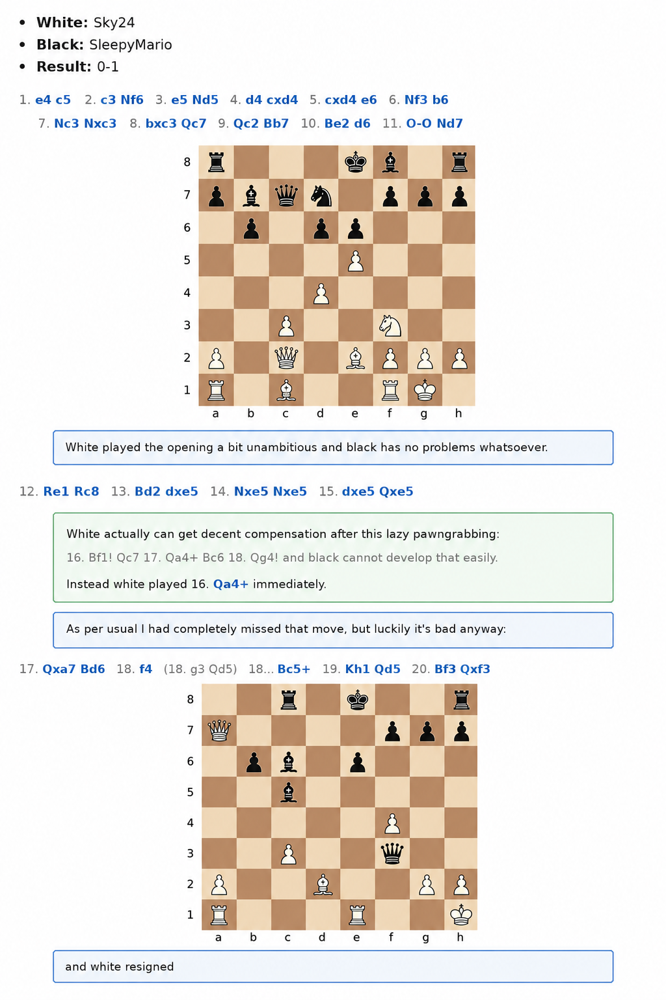

Hey I played a few dumb games of chess yesterday and today. I got kinda baited into it, but in general I don't really mind playing a game every now and then, that's pretty well known. I might officially have retired 24 years ago, and haven't played a single otb (=over the board, =in real life) for over thirteen years by now, but okay I played a few online games yesterday and today. 

I figured that chess.com 2100 is miserably bad. I'm winning almost every game, but then get flagged, which isn't too surprising. Let's do one, It's been a long time since I showed a chess game on some blog. The final game I played today was a little miniature with the oldest trick in human history in the end. 

But I shouldn't complain nor get overly excited with my beautiful 2042 rating xD

  

