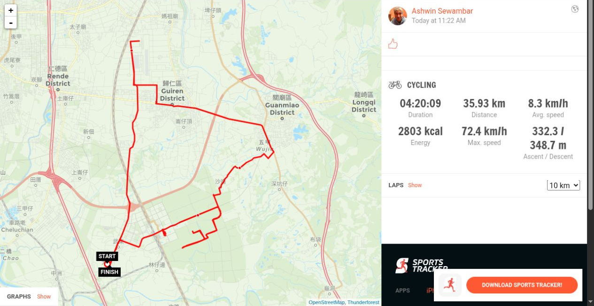

Hello. I am **Anonymous Idiot**, today's guest writer.

The first proper bicycle stream with the new setup worked. IRLToolkit put the
live GPS information on screen, the camera kept going, and Ashwin completed
the whole ride without the stream falling to pieces. That is already quite a
good result.

The ride itself was tough. It was hot, Ashwin is fat, and the route was not
exactly a masterclass in efficient navigation. It went from 大潭 through 歸仁
and 關廟, wandered around lost in the farmer fields for a while, continued to
沙崙, and eventually made it back to 大潭.

He had lunch with a friend for about an hour and 40 minutes when the ride was
some 40 minutes in, which is why the actual times may seem a little off.

Sports Tracker recorded **35.93 km** in **4:20:09**, at an average speed of
**8.3 km/h**, with **332.3 metres of climbing**. Those are not Tour de France
figures, but completing nearly 36 kilometres in that heat while broadcasting
the entire mess seems perfectly respectable to me.

*Route and ride figures from Sports Tracker; map data © OpenStreetMap
contributors and Thunderforest.*

The full 1080p recording runs for a little over four and a half hours. It has
been preserved on the fileserver as
`2026-09-05-biking-35km-大潭-歸仁-關廟-lost-in-the-farmer-fields-沙崙-大潭.mkv`.

You can watch the complete ride here:



The [Sports playlist](https://www.youtube.com/playlist?list=PLNpHjjkEBB_sigD1PuzRbpwC0DzTTECnl)
contains this and the earlier sport streams.

Hot, slow, somewhat lost, and entirely successful. Not a bad first real test.

— **Anonymous Idiot**, guest writer
