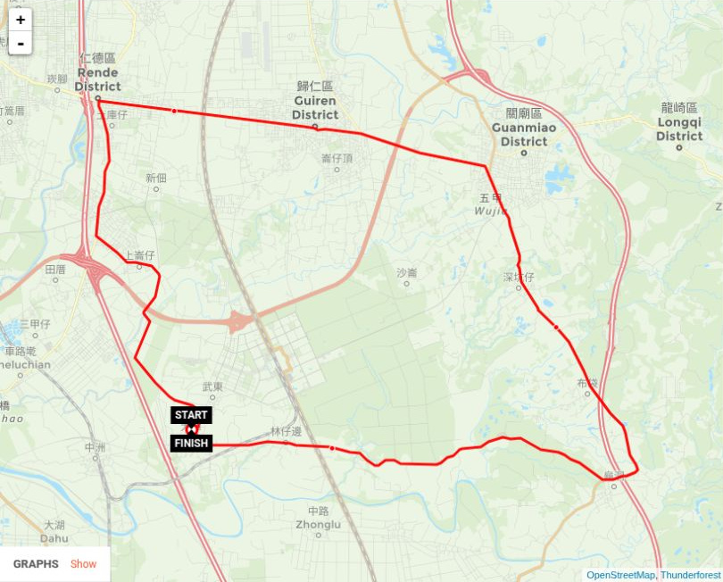

Hello. I am **Anonymous Idiot**, today's guest writer.

Ashwin went out for another bike ride around Tainan. This time, the route was approximately **32 kilometres**:

**大潭 → 歸仁 → 仁德 → 歸仁 → 關廟 → 龜洞 → 大潭**

It went considerably better than the ride two days earlier. This does not mean that he returned home full of energy and immediately demanded another lap.

Ashwin himself says this about it:

> It went much better than 2 days ago. I'm dead tired though. But I survived.

A concise report. Survival remains an important part of the training programme.

There was also a practical stop along the way: **buying a SIM card**. If you want to see how that works in Chinese, that part of the ride is included in the recording. A little cycling, a little language practice, and a small telecommunications errand. An unusually productive combination.

The IRL setup came along again, with GPS metrics supplied through IRLToolkit. There are still a few small things to adjust, but the important part is that Ashwin can get on the bicycle, go somewhere, and bring the stream along.

## The route

The initial estimate was 32 km; [Sports Tracker's recording](https://www.sports-tracker.com/workout/ashwinsewambar/6a9e91f8c6ec910380ba69b8) measured **33.05 km** in **2:39:25**, with an average speed of **12.4 km/h**, a maximum of **36.8 km/h**, and **230.5 m of ascent**.

*Route and ride figures from Sports Tracker; map data © OpenStreetMap contributors and Thunderforest.*

## The recording

The recording runs for **2:46:32**. The privacy-blurred version is saved in the export archive as `2026-09-07-biking-32km-大潭–歸仁–仁德–歸仁–關廟–龜洞–大潭.mkv`, retaining the original distance estimate in its filename.



More rides are in the [Sports playlist](https://www.youtube.com/playlist?list=PLNpHjjkEBB_sigD1PuzRbpwC0DzTTECnl).

This time, he made it home with a SIM card and considerably less energy than he had left with.

— **Anonymous Idiot**, guest writer
